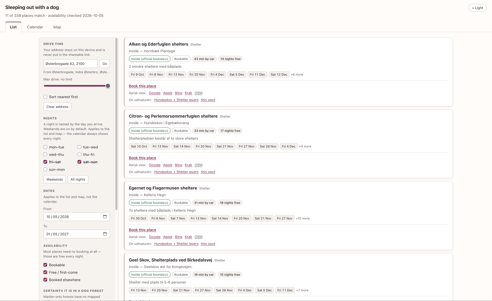
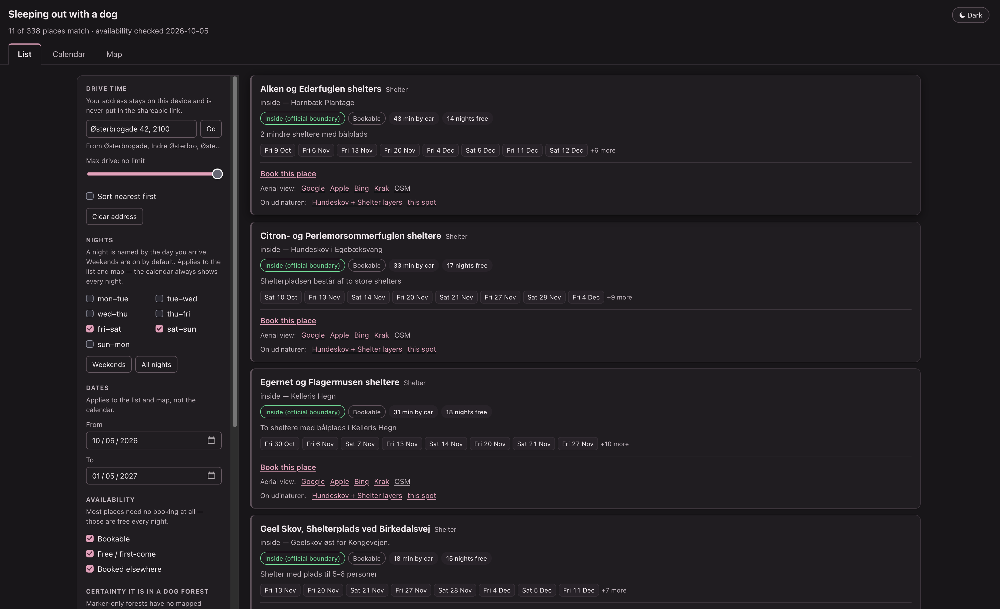

# 🐕 hundeskove

**Where can I sleep in a forest where my dog can run free?**

Denmark has *hundeskove* — forests where dogs may roam off-leash — and it has
shelters, campsites and free-camping spots you can book for a night. This
project finds the places where the two overlap and shows which nights are still
free.

<!-- TODO: replace with a screenshot -->



- **Map, list and calendar** over one shared set of filters.
- **Honest about certainty** — from "inside an official boundary" down to "only a pin on the map".
- **Direct booking links** and aerial-view links for every place.
- **Drive time** from your own address. It never leaves your browser.

## Run it

You only need [mise](https://mise.jdx.dev). It installs the rest (Node, uv and
[just](https://just.systems)) for you.

Nothing is installed system-wide. mise keeps its tools in
`~/.local/share/mise/` and only puts them on your `PATH` inside this folder, so
your own uv, just and Node are left alone. Python packages go in `.venv/` and
JS packages in `ui/node_modules/`.

```sh
mise install            # Node, uv, just
mise exec -- just setup # install Python and Node dependencies
mise exec -- just ui    # fetch the data, build, and serve http://127.0.0.1:8000
```

The first run fetches everything and takes a few minutes. After that:

```sh
mise exec -- just availability   # refresh which nights are free (fast, run it often)
mise exec -- just discover       # re-find places near dog forests (slow, rarely needed)
mise exec -- just dev            # UI with hot reload
mise exec -- just check          # typecheck and run all tests
```

Already have `mise activate` in your shell? Drop the `mise exec --` and just
type `just ui`. `just --list` shows the rest.

## Good to know

- Data comes from [udinaturen.dk](https://udinaturen.dk) and
  [book.naturstyrelsen.dk](https://book.naturstyrelsen.dk), through
  undocumented endpoints. Be gentle with them.
- Dog-forest outlines missing upstream are filled in from OpenStreetMap
  (© OpenStreetMap contributors, ODbL). See [`LICENSE-DATA.md`](LICENSE-DATA.md)
  before redistributing the data.
- Running a public instance? Change `CONTACT` in `src/hundeskove/__init__.py`
  to your own address, and put a reverse proxy in front of `serve`.

## License

MIT, see [`LICENSE`](LICENSE). The data has its own terms: [`LICENSE-DATA.md`](LICENSE-DATA.md).
